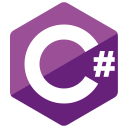
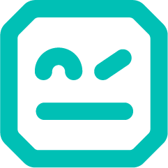
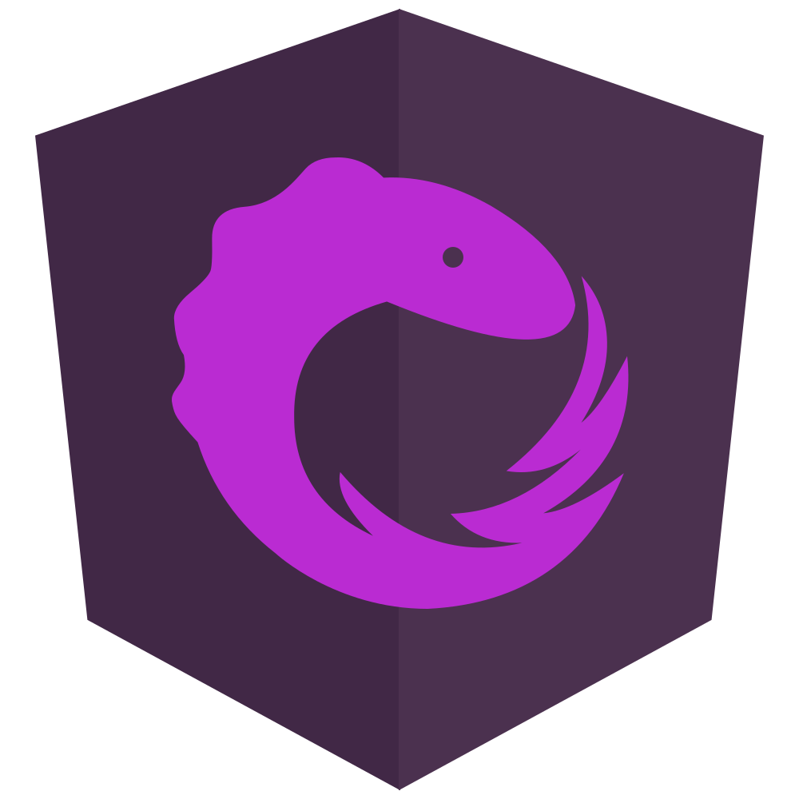
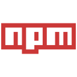

# Hello, I'm Viktor 👋

I'm a professional full-stack software developer with expertise in .NET and JavaScript technologies. Welcome to my GitHub profile! Here you'll find a collection of my work and personal projects.

## About Me

- 🔭 I’ve been coding since 2012 and have experience in web applications using the .NET stack and modern JavaScript frameworks.
- 🌱 I’m continuously learning and exploring new technologies to stay up-to-date in the ever-evolving world of software development.
- 💬 Ask me about anything related to full-stack development, .NET, JavaScript, or software architecture.
- 📫 You can reach me via email at [viktor.sacharkin@gmail.com](mailto:viktor.sacharkin@gmail.com).

## Skills

## GitHub Stats

## Get in Touch

- 📧 Email: [viktor.sacharkin@gmail.com](mailto:viktor.sacharkin@gmail.com)
- 🐦 Twitter: [Viktor_Sach](https://twitter.com/Viktor_Sach)
- 🎨 Icons: <https://techicons.dev/>
